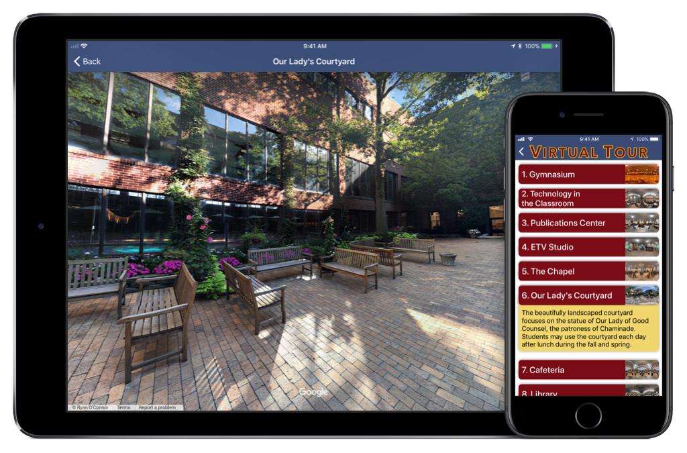

**Released September 2017** – The completely redesigned iOS application for Chaminade High School will serve as a hub for both incoming students as well as current students, including instant access to the latest events and news.

- **Events & Lunch** – Check out both general and athletic events up to a month in advance, and see what’s for lunch at the Courtyard Cafe.
- **News** – The new Chaminade app uniquely blends both the school’s news from the website and Tarmac Online. You will always be in the loop by checking one, centralized news feed.
- **Academics** – Easily view courses for all four years at Chaminade, and contact the teachers in easy department at your fingertips.
- **Campus & Virtual Tour** – You are greeted with the point of view flying into Mineola, NY with Chaminade front and center. Continuing to the virtual tour section, learn more details about locations throughout the school, and view interactive 360-degree photographs as if you are walking through the school!
- **Activities** – View the full clubs and activities listing, rich with detailed descriptions, photos and videos.
- **Athletics** – View all of Chaminade’s sports, filterable by season, each with photos to make looking through this section super immersive.
- **Religious Expression** – Learn about Chaminade’s involved spiritual activities and daily routines, including retreats, sodality, and monthly school-wide masses.
- **About Chaminade** – Learn some basic info and history about Chaminade, including links to Chaminade’s social media accounts, and quick access to the school store and website.
