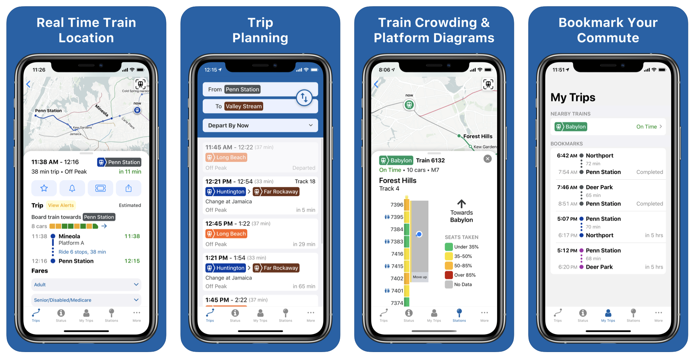

After being inspired by a new train-tracking website at [mylirr.org](www.mylirr.org), I joined the MTA LIRR in May 2019 to build a new mobile app for commuters. That summer we began development on a React Native movile app. Initially under the name myLIRR, the app had real-time location, train status, and service alerts at its core. Yet, during our development we realized the importance of capturing the 70,000 users a day on the existing TrainTime app.

The (old) TrainTime app hadn't been updated since 2014, and needed to be redesigned to provide more data, and accurately. We took the core features from TrainTime - trip planning, station departure boards, and service alerts - in combination with the new real time features, and set out to make a major update to TrainTime.

But then, the COVID-19 pandemic struck. Already in the works, real time crowding information became a top priority on the project as we knew this information would be more important than ever for riders returning to the railroad. Paired with more commuter features such as bookmarks, notifications, and trip sharing, we launched the app in June 2020, with a very successful press conference.

Read more about the app and try it out using the collection of links below.

## The App

[Marketing Website and App Store Links](https://app.mylirr.org)

<iframe width="48%"height="250px" src="https://www.youtube.com/embed/bf6_TsAkJMg" frameborder="0" allow="accelerometer; autoplay; encrypted-media; gyroscope; picture-in-picture" allowfullscreen></iframe>
<iframe width="48%"height="250px" src="https://www.youtube.com/embed/_jWEny4xVG4" frameborder="0" allow="accelerometer; autoplay; encrypted-media; gyroscope; picture-in-picture" allowfullscreen></iframe>

## Press Coverage

### [Newsday](https://www.newsday.com/long-island/transportation/lirr-app-trains-social-distancing-coronavirus-1.45763094) | [News 12](http://longisland.news12.com/story/42254545/lirr-app-helps-riders-see-how-busy-train-cars-are-before-boarding)

### [Chaminade News](https://www.chaminade-hs.org/about/news/news-posts/~post/ryan-oconnor-19-rethinks-possible-with-the-mta-lirr-20200619)

### [Telemundo 47](https://www.telemundo47.com/noticias/local/lirr-lanza-herramienta-que-ayuda-a-los-usuarios-a-mante/2065914/)
