---
title: The WWDC 2017 Experience
date: "2017-06-20T22:12:03.284Z"
description: What it was like to attend Apple's annual developer conference as a scholarship winner
--- 

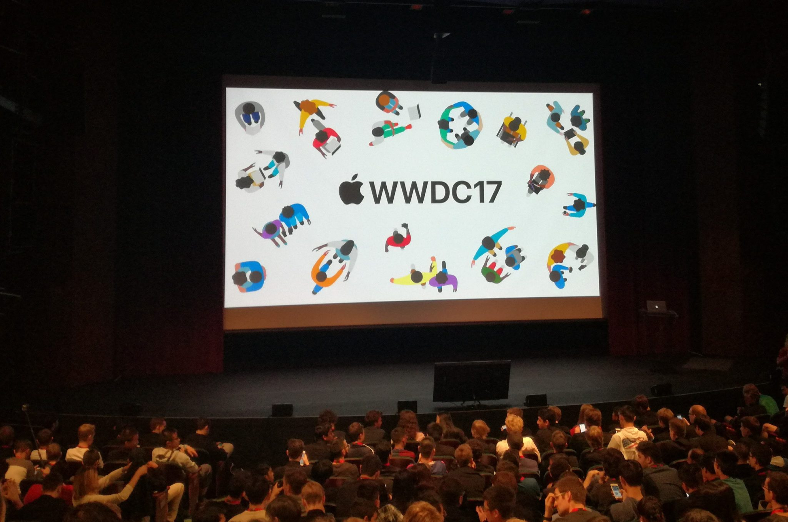 

In June 2017, I attended Apple’s Worldwide Developer Conference as a Scholarship Recipient. I wrote about my experience each day as a personal memory of the amazing week, and to also inspire others. The 3-part series was originally featured in my high school's <a target="_blank" href="https://chstarmac.com/2017/06/19/the-apple-of-our-eye-ryan-oconnor-19-wins-scholarship-to-wwdc17/">online newspaper</a>.

-----

### Introduction

 I am Ryan O’Connor, a sophomore and passionate app developer. I have been into programming and app design for about four years now and am also in the progress of developing an all-new app for Chaminade. Recently, I had the opportunity to attend Apple’s Worldwide Developer’s Conference, an annual weeklong event to bring developers together from around the world to learn, share, and connect. This year, the conference was held in San Jose, California. I attended the conference as a winner of Apple’s Scholarship Program, and I’d like to share my experience throughout the week to give an insight on what it’s like to attend.

### The Scholarship

Tickets for regular admission to attend the conference are not cheap, at $1,599, and you’ll only get a chance to buy one if you’re randomly selected among 5,000 other developers. However, Apple offers 350 students a scholarship to attend the conference for free. The submission requirements included the following: a Swift Playground project that demonstrated one’s creativity and coding skills, an essay describing the project, and a second essay explaining one plan’s to share his or her coding knowledge with others. Swift is Apple’s newest programming language for creating apps, and a Playground is a simple and interactive code project.

| 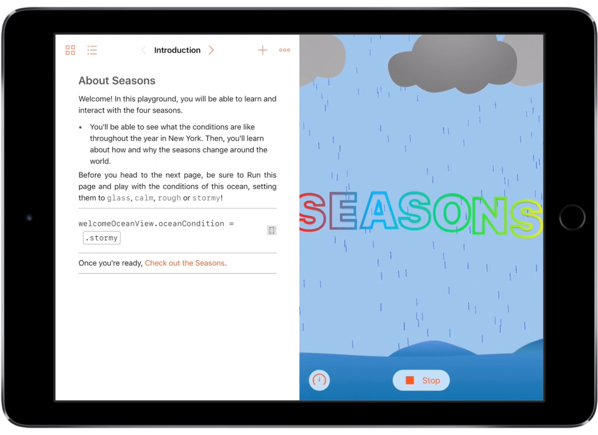 | 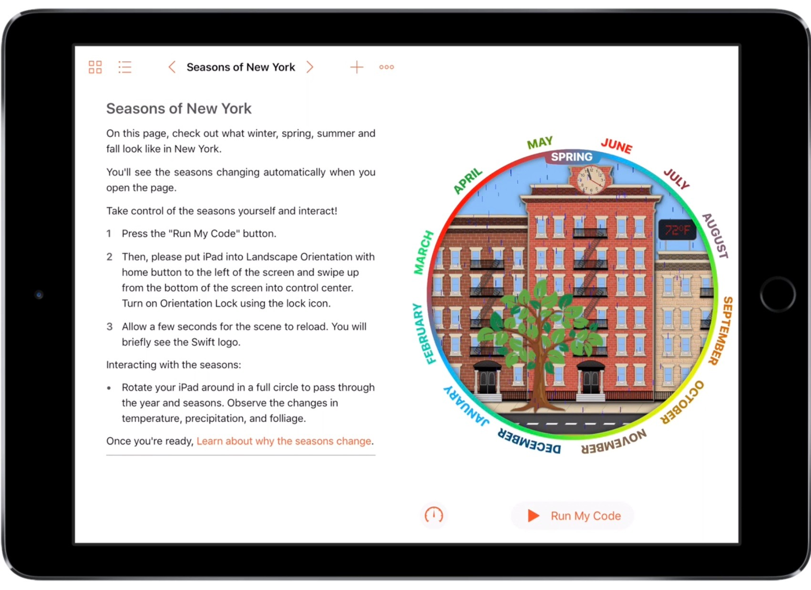 |
| -------- | --------- |
| 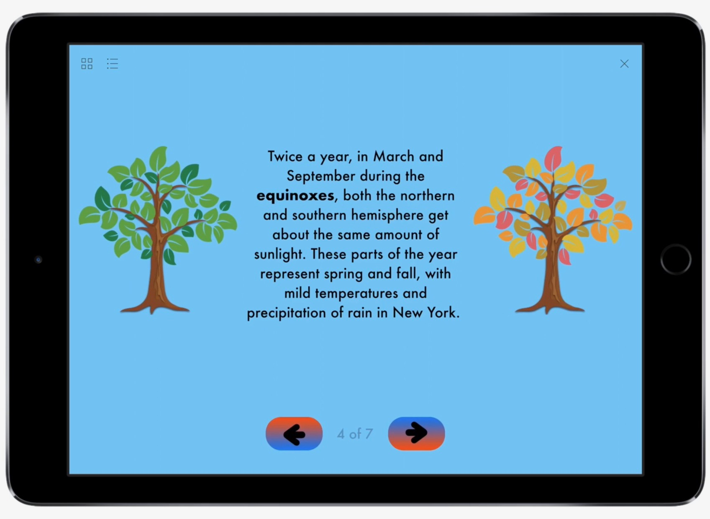 | 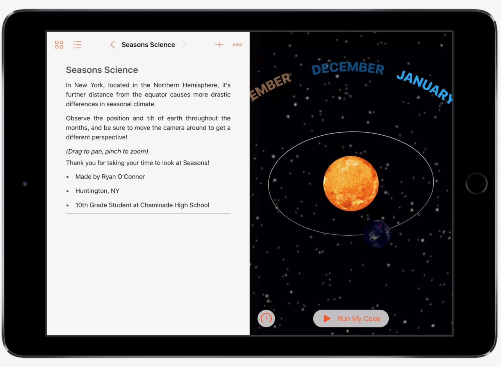 |
<iframe class="youtube-player" type="text/html" src="https://www.youtube.com/embed/vu6X3VcbNa4?version=3&amp;rel=1&amp;fs=1&amp;autohide=2&amp;showsearch=0&amp;showinfo=1&amp;iv_load_policy=1&amp;wmode=transparent" allowfullscreen="true" style="border: 0px; display: block; margin: 0px; border-radius: 8px; align-content: center;" class="img25" "data-ratio="0.5627659574468085" data-width="940" data-height="529"></iframe>

_Swift Playgrounds Book for iPad that won Ryan the scholarship._

For my scholarship submission, I created an interactive Swift Playgrounds Book for iPad which teaches about the four different seasons. In the first section, I introduced myself with an ocean scene. The second scene interactively changed throughout the seasons; the third section explained why the seasons change, and the fourth section displayed the earth revolving around the sun to give insight into how the science works. While the underlying concept of my project was relatively simple, it displayed my programming skills, creativity, and eye for detail. For that, Apple rewarded me with a ticket to the conference! Watch my submission here.

### The Arrival

I was extremely excited boarding the six-and-a-half hour flight from New York to San Francisco International Airport. A valuable part of my journey was meeting many different people. Halfway through my flight, I noticed that the person sitting next to me was reading some information about the conference. He was another developer attending the conference, as he was the co-founder of the popular mail app AirMail. Based out of Italy, he discussed many challenges he has faced while developing apps. He said it is quite difficult to manage all of the different aspects of being an individual developer – including planning, marketing, implementing new features, providing customer support, and tracking down issues. He told me that it pays off to be able to create something from the ground up.

“It’s really amazing to see nothing, over time, turn into something amazing, that you can hold in your hand,” he told me, stressing how much opportunity there is in the field. One could work at a large company such as Apple or Google and great experience from professionals in the field, or he or she could choose to work at a startup, which provides great experience across multiple positions. Additionally, within the platform, the options are endless, as apps can range anywhere from an audio or video player to a productivity app like AirMail.

### Sunday, June 4

On this day, scholarship winners attended an exclusive orientation, which very interesting because it gave some insights into Apple’s practices and values, as well as some handy information to get the most out of the week ahead. As a first-time attendee, this was especially helpful to me.

The presenters first used Apple Pencil as an example of how all of the components of a product must fit together seamlessly. First, they explained the mastery of the hardware that made up the device, and then various software challenges involved in connecting the pencil to the iPad. One challenge that they faced was reaching the smallest possible response time while not overloading the iPad and draining battery. The humorous solution to this was to disguise the integration across multiple different use cases – the same technology for the Apple Pencil was hidden inside code for the iPad Air 2’s new touch system and the iPhone 6s’s 3D Touch system to respond to force! I found it quite amazing that they were able to “reuse” frameworks (common codes that provide a specific functionality) so that it was very easy for developers to adopt features such as Apple Pencil into their apps.

The overall topic of this section of the presentation was to show the art of making something that involves an enormous amount of work to design and engineer, yet is not apparent to the user how hard it was due to the simplicity and perfection of the final product.

Apple then reminded us that the most important part of the whole week was to network. While the hundreds of sessions could be watched online after the conference, the priceless opportunity to talk to Apple engineers and other developers was something that should not be missed.

The orientation wrapped up with a group photo on stage and a surprise visit from Apple’s CEO, Tim Cook. And not to be forgotten — this year’s gift to developers was a brand new Apple TV 4!

Following orientation, I visited Apple Park, the company’s new $5 billion campus which is under construction. This was stunning to see in real life. And of course, being so close by, I had to check out the current campus at Infinite Loop, as well as Stanford University’s campus.

### Monday, June 5

Monday was the most important day of the entire week. On this day, Apple held a conference to announce their most important new software features and announcements.

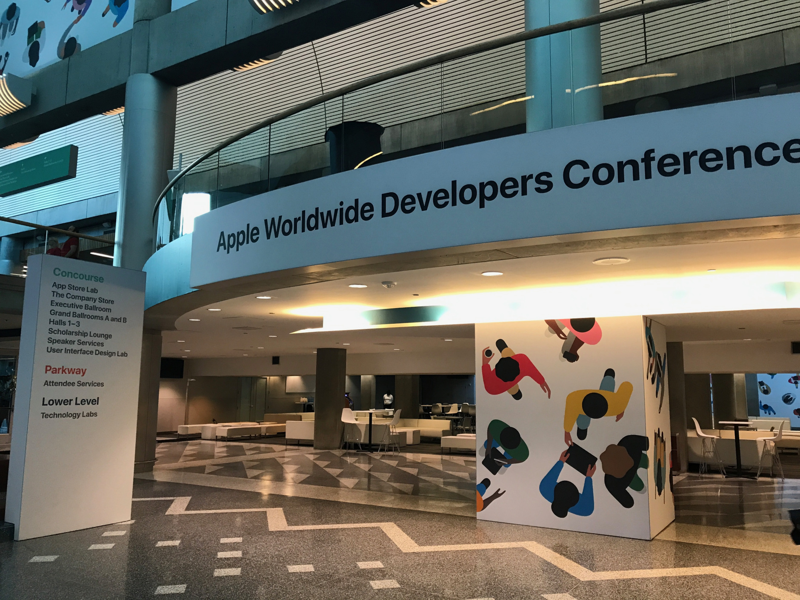
_Inside the convention center._

The presentation kicked off with a description of some minor updates to tvOS, the operating system for Apple TV, and some new watch faces and redesigns for watchOS, the operation system for Apple Watch.

During the keynote, Apple CEO Tim Cook also highlighted that the youngest developer attending was a 10-year-old boy from Australia who has already produced five apps on the App Store, while the oldest developer attending was 82 years old from Japan, having just published her first app earlier this year.

The excitement really started when the announcements for macOS, Apple’s Mac operating system, began. Enormous speed improvements across the line were highlighted.

Another section especially stuck out to me due to its importance to students. This year, Apple added a Files app to iPad, which will allow us students to see all of their files from all of their apps used in one place…This is a huge update for students, and I think it will be extremely helpful when it launches publicly this fall.

After watching the keynote from the live stream for years, it was truly amazing being part of the excitement and cheering throughout the entire event. A notable addition to the new version of macOS was the movement to Apple File System, which replaced a file system that was decades old. This update had already come to devices running iOS earlier this year (iOS 10.3 or later).

Interesting hardware updates followed, with some speed improvements to existing models and the announcement of a radically new product, the iMac Pro. This device, geared towards professional video and graphics editors, packed an astonishing 18-core CPU and 128 GB of memory!

Following that, the peak of the event was focused on iOS, the mobile operating system for iPhones and iPads. Some interesting design and feature additions were made. One section that particularly interested me was the Vision and Machine Learning Frameworks. This functionality lets developers analyze (using machine learning) what a camera sees in real time, such as a person’s face or a guitar that they are holding, and then render an object on top of that person as if it were floating in real life. There are endless applications to these new features, which I am very excited to explore.

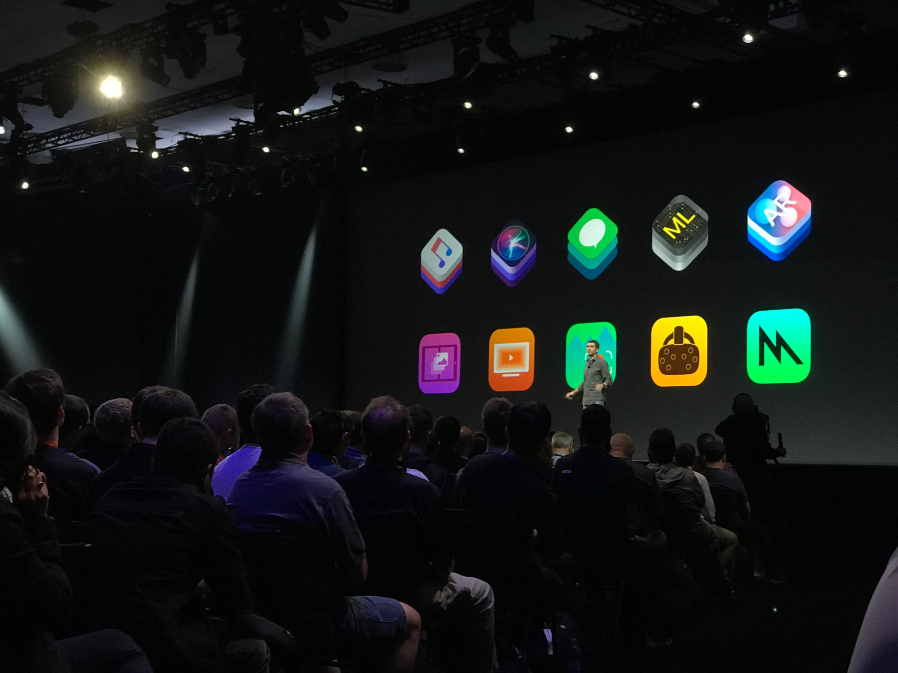
_iOS 11 presentation during the Keynote._

Another section especially stuck out to me due to its importance to students. This year, Apple added a Files app to iPad, which will allow us students to see all of their files from all of their apps used in one place. Furthermore, drag and drop is now supported between different apps across the whole system – for example, dragging text, images, website URLs, and much more – to compile rich content on iPad.  Additionally, many more apps can now be stored in a dock which can be accessed from anywhere. This is a huge update for students, and I think it will be extremely helpful when it launches publicly this fall.

 | | |
 | --- | --- |
| 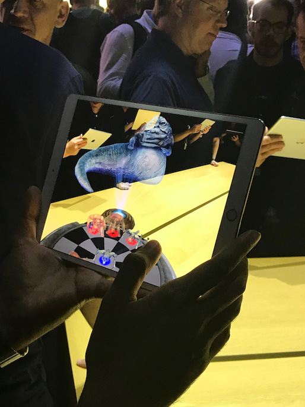 _Star Wars Augmented Reality on the new 10.5” iPad Pro._ | 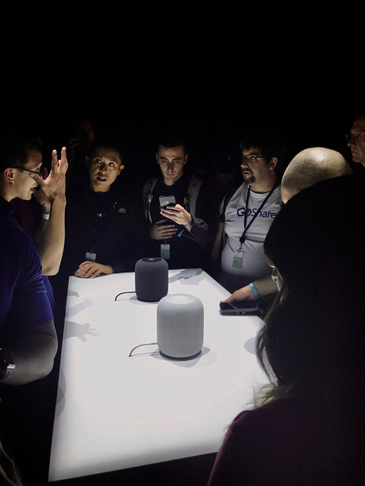 _HomePod preview on display._ |

Apple also launched two more brand new products. First, a never seen before 10.5-inch iPad Pro with astonishing graphics and computing capabilities was released. The company demonstrated this device being used for Augmented Reality. One example involved placing a coffee cup, lamp, or plant on a table in real time through the device’s camera. Then, developers took it even further by rendering full scenes through the camera that you could walk around and interact with. I certainly enjoyed playing around with this framework this week, and I even used the template of a spaceship floating in real time to develop my own bread trail out of Apple logos (haha!), an AR solar system, and much more. Expect many more AR and “learning” apps in the near future due to the new frameworks provided by Apple to make these great apps!

The second new product that Apple released was called HomePod, a  high-quality speaker with smart capabilities allowing you to use voice commands to change our music or ask for things like the weather forecast. Apple is trying to get into this game with other companies such as Google, with Google Home; and Amazon, with Alexa.

Following the keynote, we had the chance to get a preview of the soon-to-be-released HomePod and iMac Pro in a stealthy Space Grey color, and play with some more of the Augmented Reality features in live action.

The next event for the day was the Platforms State of the Union. I won’t go into too much detail simply because of how much detail this event provides. It is more focused on the technical and code changes that some of the new features bring, so it was great for Apple to show us how we can implement the new features in our own apps. I would, however, like to mention the Swift Playgrounds app for iPad, which is an amazing and powerful resource for anyone who is interested in learning how to code. This event talked about how I, as a developer, could add features to my apps for functions like Siri, Drag & Drop and Split Screen, Machine Learning, Vision and AR, and much more.

Today was also a great day to really start meeting some of the great scholars and other attendees from around the world who are just as interested as I am in walking around a conference hall holding my phone up in the air to try out an AR that we just programmed! Shown in the picture below, everyone is anxiously playing with all of the new betas, or pre-release software, so they can get their hands on the new features and code.

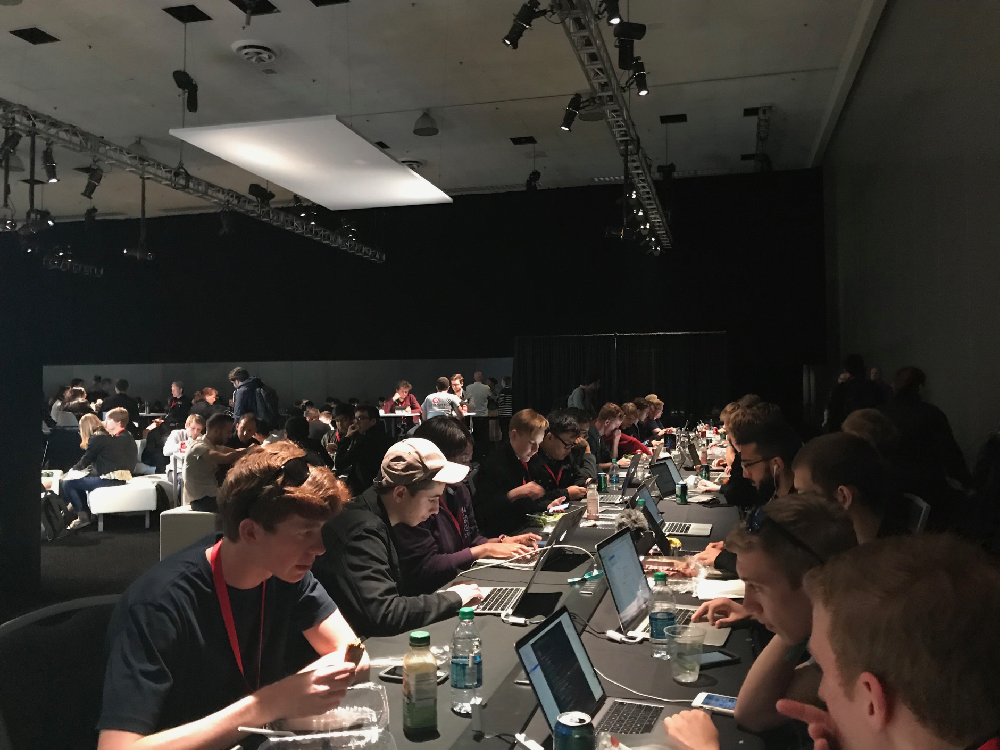
_Scholarship Lounge – attendees play with new betas, so they can get their hands on the new features and code_

### Tuesday, June 6

From Tuesday through Friday, hundreds of sessions and labs were held for us to attend. While there, we learned more about new technologies, asked for help from Apple engineers, or just hung out and coded.

Tuesday stood out, however, we received a surprise visit from former First Lady Michelle Obama.

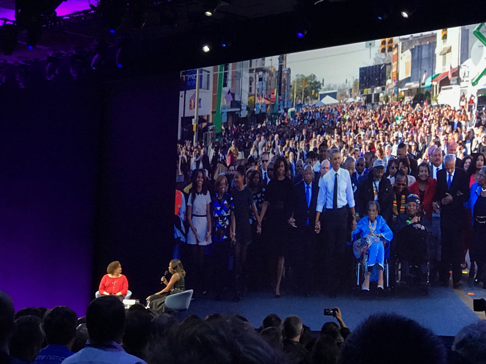
_Michelle Obama speaking to developers._

In her talk, she touched on various topics, such as what she has been doing since her husband left office and some initiatives she has undertaken. She talked to us developers and entrepreneurs about how our jobs cannot be done alone, as it is very important to have someone else who shares your values to be with you along the way, because one person cannot see every angle or possibility of a situation.

Mrs. Obama also discussed how making a difference often starts with small ideas and actions. You can try to act on a large scale, but where it really matters is at a local, community level. Then, the former First Lady talked about the importance of women must advocating for themselves because they are just as important in the industry as everyone else. Finally, Mrs. Obama talked about how as app developers, we must be role models to the world, as people all across the globe use our apps.

Afterwards, I attended sessions on topics like Machine Learning and Privacy. The Machine Learning session was particularly interesting. I learned all about the great tools that Apple has provided us with – for example, I experimented with one of the many already-trained models that can detect things like people, places, and objects using a camera. Then, I simply imported the model, and with a few lines of added code, it was ready to go!

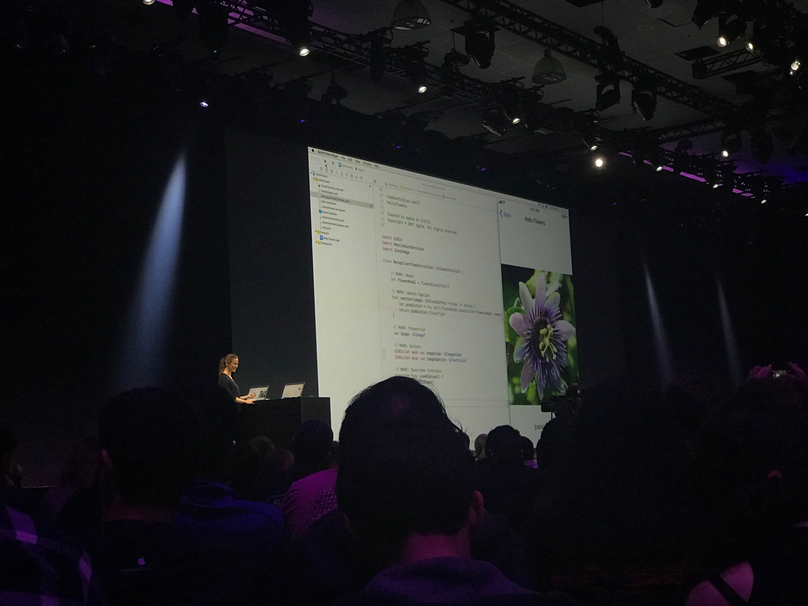
_Core Machine Learning Session_

Fundamentally, the way the system works is that it gets input from the Vision (camera) or Natural Language Processing (text) frameworks, analyze it using Core Machine Learning, and then display feedback to the user using either simple text, or by overlaying objects on the scene using AR.

For example, I was shown how the camera can detect someone holding a guitar using the camera, and then use the ARKit framework to overlay a bubble with the guitar emoji right next to the person’s head!

I also attended some labs, where Apple engineers helped me with specific questions pertaining to things like my tvOS (Apple TV) app, iMessage apps, and data storage.

The last part of my day included a User Interface Consultation. Each developer is entitled to one of these throughout the conference. There, I had two Apple designers sit down with me and talk about me design practices and how I can improve them. While they were quite critical, I was happy that I got lots of feedback on how I can improve my design techniques. Specifically, we talked about the new app I am working on and how I can make the experience more intuitive, simple, and consistent. They stressed that I must prioritize my material well according to how much I think each section will be used.

### Wednesday, June 7

On Wednesday, I went to fewer sessions and labs so I could work on redesigning my app based on the feedback from my design appointment. I think that the criticism helped me see something that was clearly missing from my app design, and it’s a one-of-a-kind experience that you can only get at WWDC. The nice part about the lounge where I could work was that I could code while watching a live session either on the televisions inside or streaming it on my computer.

| | | 
| --- | --- |
| 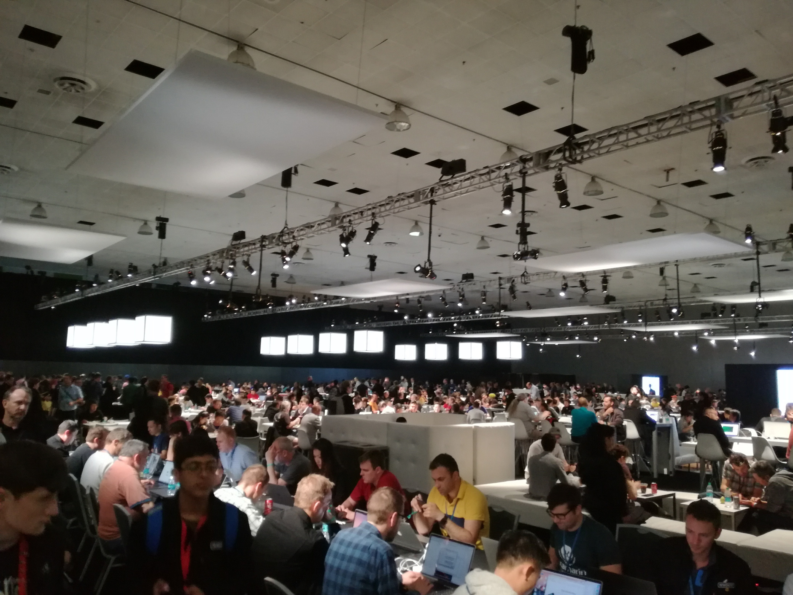 _Liveliness and hard work in the lounge_ |  _Breakfast after the first morning session_ |
Additionally, breakfast, lunch, and afternoon snacks were provided, so the lounge was a great place to refuel and code between events.

Some notable sessions that I attended were Debugging with Xcode 9 and Natural Language Processing. In the debugging session, I learned some new techniques to track down problems in my code or my user interface. I learned about some interesting new features in the recently released version of Xcode, the Integrated Development Environment (IDE) where I can write all of the code and make user interfaces for my apps. Another feature in Xcode 9 is wireless debugging, meaning I don’t have to connect the device to my Mac with a USB cord every time I want to run an app on it.

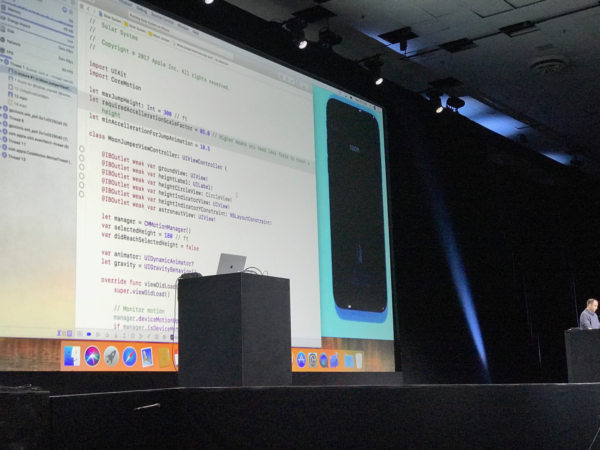
_Wireless Debugging in Xcode 9_

In the Natural Language Processing (NLP) session, I learned about some of the techniques to use Machine Learning to search a specific language. By specifying a language, it can intelligently return all content with associated forms of a word. For example, by searching “hike,” the demo program could return all images with captions including forms of the word like “hike,” “hiking,” “hike,” “hikes,” etc. There are so many applications to this including intelligent content search in-app to a filter for a social network.

In the evening, this time was dedicated to “meet-ups.” There were several different meet-ups including Education, AR/VR, Diversity, Photos and Videos, Business, and Worldwide areas where people could talk about how they innovate or plan to innovate in the field, and be inspired. I visited the Education meet up and learned about some of the companies that have been working to make it easier to teach students from kindergarten to college how to code. Some include Sphero–a rolling ball that can be controlled with Swift Playgrounds–and CodeSpark–an app that uses a building block game to teach about the different types of data in an app and the functions necessary to control the hardware. Many of these solutions ranged from basic interaction with the companion app to more in-depth code, suiting all ages.

On Wednesday, Apple also announced the winners for the annual Apple Design Awards. One of the winning apps was AirMail, made by the developer I had sat next to and talked with on the plane ride to California! This prestigious award is given to apps with outstanding design, functionality, attention to detail, and accessibility.

### Thursday, June 8

Thursday was a spectacular day – it felt like the peak of sessions and labs, and there was also “The Bash” too!

It all started to feel like a routine now – arriving at the conference center around 8:45 AM, grabbing some breakfast, and heading to the first session of the day. Today, the 9 AM session was Core ML (Machine Learning) in Depth. What’s cool about machine learning is how flexible it is. While there’s a wealth of models available that have already been trained, people will likely want to expand outside of the capabilities of an existing model. This session talked a bit about how to train your own model. Training a model is tough because a lot of data is required to “teach” it. For example, if you were trying to get a model to recognize a pool, you would have to run images through the model at every angle, and then correct the wrong result using the correct result, a pool. This is called a Neural Network, one of the many techniques used to train a model. The weights are adjusted on the model to create the proper calculations. Then, the completed model is converted in the custom MLModel format and available to use in an app.

Then, I attended a UIKit lab. UIKit is the fundamental and most commonly used method to display content on a screen, making things possible such as text, using a UILabel or UITextView, a rectangle that can have other objects inside of it, called a UIView, a button that can trigger an action, called a UIButton, and so on. The possibilities are truly endless as you can customize all of the properties of the different interface elements. I specifically went to the lab to get help with a layout problem I was having in the Chaminade app where it would not size the height of a label correctly. I got help from an engineer, who upon looking over my code and determining that it was all correct, had me file a bug report. Unfortunately, this didn’t fix my issue, but since he works on the UIKit team, he said he would take a look at the bug as it’s clearly a problem on their end.  Speaking of bug reports, that was the seventh bug I had reported since Monday! The great part (for me) about beta testing the new software such as iOS 11 is that while the experience may not be as stable for me, I am helping perfect the software so that it’s working great for the public release in the fall.

| | |
|---|---|
| 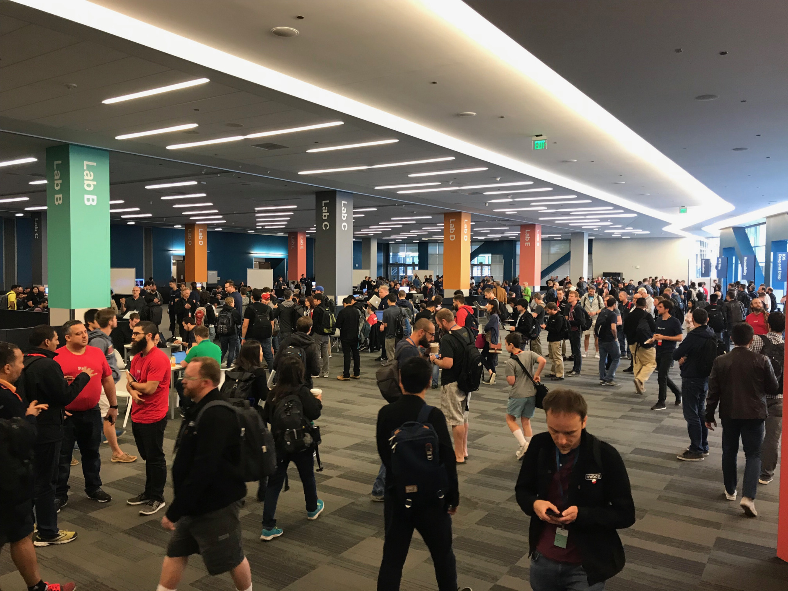 Lower Level featuring all of the labs | 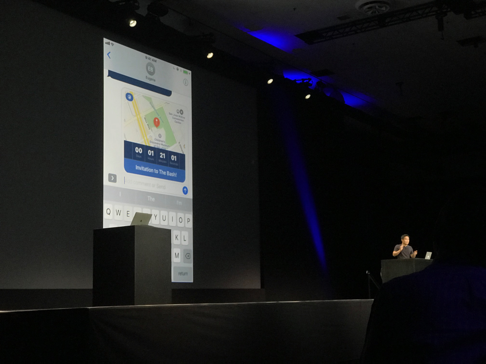  Live iMessage Apps Demo |

I attended some more labs in the afternoon, such as the Core ML and ARKit lab in conjunction. I mapped out a general path to take to work on an idea I have regarding machine learning and augmented reality, and having the engineers right there to steer me to the right technologies was an amazing opportunity. I also stopped by the WatchKit lab to learn about some best practices when making a companion app for an iPhone app, and a Swift Playgrounds lab to learn about intuitive ways to create Playgrounds Books to help teach others how to code. I plan to actively make books next year to assist with the Swift curriculum that all students will be taking part in.

To close the day, I attended two more sessions.  In the Advanced Animations with UIKit session, I learned about how to make intuitive, interactive animations in my app. For example, when dragging up from the bottom of the screen to show Control Center, and most likely letting go mid-drag, that is an example of interactive animations because the animation is completed for the user automatically. And finally, What’s New in iMessage Apps highlighted some new features. If you’ve ever sent a rich message with an iMessage app, for example, a game move (such as GamePidgeon), you’ll notice that it only displays a static image and title. However, now, it is possible to have a live view inside the conversation, so you could see a game move animate right in the conversation without even opening the message. I think this opens up some really cool possibilities for iMessage apps because it’s so easy to send rich, interactive content to your friends and family.

It was quite the day packed with some awesome sessions and labs! But of course – we still had The Bash!

Picnic tables at Discovery Meadow made it a great spot to hang out
The Bash was held at Discovery Meadow in San Jose, only 2 blocks from the convention center. They had various food options, drinks, tables to hang out at, and a game area. Then, Craig Federighi welcomed Fall Out Boy to exclusively perform for us.

This event was an awesome time to take a break from coding and hang out with the friends I had made throughout the week. Lodging was provided for the first time this year, at San Jose State University, so this allowed me to easily hang out with other scholarship winners during and after the conference each day. Another thing I’d like to mention is truly how diverse the conference was. On Monday at the Keynote, Tim Cook announced that 75 countries were being represented at the conference!

From left to right in the image below, instead of naming each of my friends, I’ll say where they are from — New Jersey; Sacramento, CA; Toronto, Canada; South Africa; England; Northern Ireland; and New York.
It was an awesome performance by Fall Out Boy, and overall, a fantastic night.

| | |
| ---|---|
|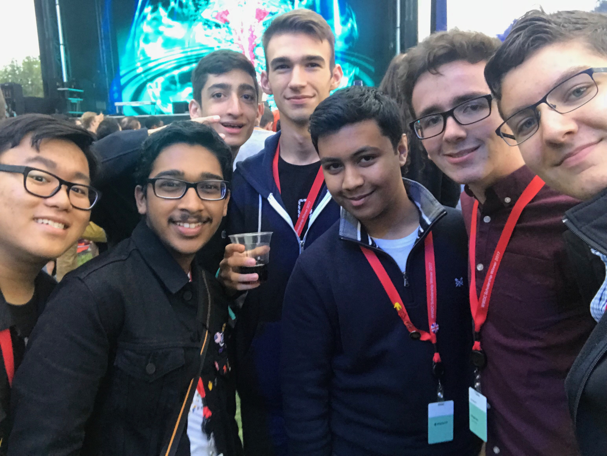 From left to right in the image below,  instead of naming each of my friends,   I’ll say where they are from — New Jersey;  Sacramento, CA; Toronto, Canada; South Africa;  England; Northern Ireland; and New York. | 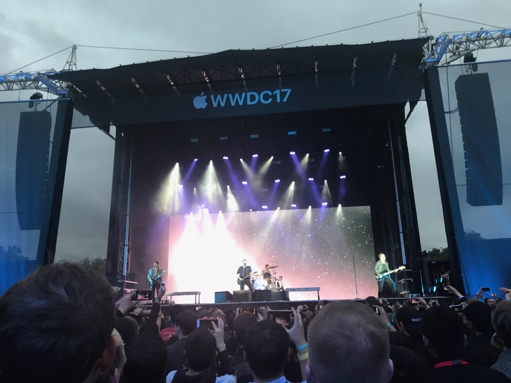 Fall Out Boy performed |

### Friday, June 9

The conference was a lot quieter on Friday after the long week. I first attended a session on Auto Layout allowing me to easily scale my apps’ user interface between different sized devices. Using traits like vertical and horizontal spacing, proportions, and equal sizes, I can easily make my app look great across many devices.

SiriKit Lab
My last event at the conference was a lab focused on SiriKit. SiriKit is a framework that allows developers to enable users to ask Siri to do certain things in their app. There’s many different supported “intents” as they are called, such as Notes and Lists, Car Unlocking, Messaging, Calling, and more. For the Chaminade app, I wanted to try to add a Siri feature allowing users to ask, “Show me a list of events at Chaminade”. The key word is list, because while they don’t technically have an events intent, there is a list intent. So by using the events parameter, I can return the upcoming events, just with a simple voice command. However, when working on this, I ended up working with not one, but four Siri engineers! We had found a bug in the framework that when the request used “Chaminade” as the app name, it could not find my app but instead the stock Notes app on iPhone. But when I changed the app name to “Chaminade HS” and used that in the request, Siri connected to the extension of the app and successfully presented the card that would show the events. It’s always comforting to stump the engineers once in a while to make sure I’m not going crazy!

I hope this series documenting my trip inspires you to join a world of opportunity, a chance to reach people all around the world and promote change with your creations.

My badge and some of the several pins I collected throughout the week
Unfortunately, the spectacular week went by super fast! I simply cannot express in words and even images what it felt like to attend the Apple Worldwide Developers Conference 2017 as a Scholarship Winner. It truly is a worldwide event bringing people together from all over the world to learn, connect, collaborate, and celebrate the awesome creations that developers produce. I hope this series documenting my trip inspires you to join a world of opportunity, a chance to reach people all around the world and promote change with your creations. Additionally, I hope this gives you a new perspective on what it’s like to be a developer, and what it’s like to attend the largest event of the year for Apple Developers.